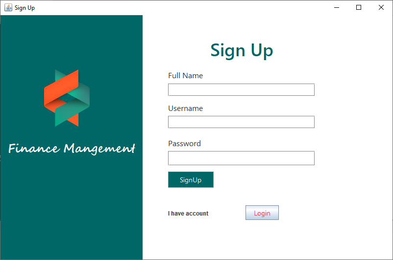
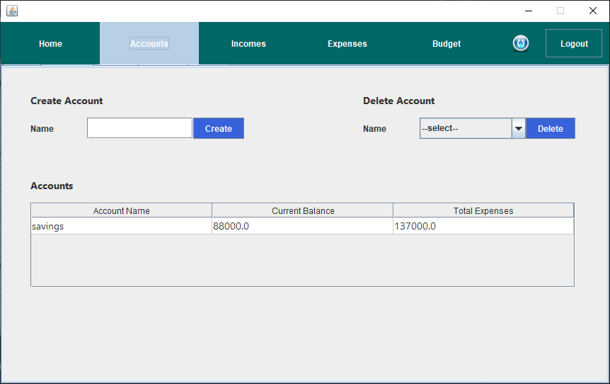
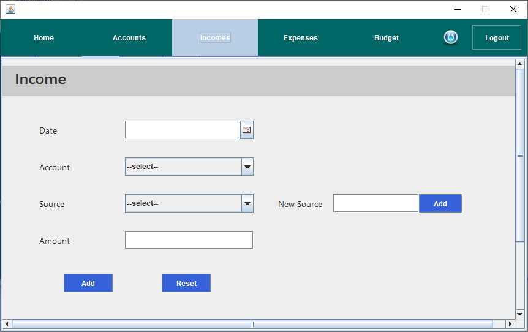

# Personal Finance Management System 💰

## Overview
The Personal Finance Management System is an application built with Java Swing on Apache NetBeans IDE and MySQL for Database Management. This helps users to monitor their financial habits, track previous transactions, and visualize monthly financial data using charts.

## Technology Used
- **IDE:** Apache NetBeans
- **Database:** MySQL
- **Java UI Framework:** Java Swing
- **Chart Library:** XChart

## Features
1. **Account Management:** Users can create and manage multiple financial accounts.
2. **Income and Expense Tracking:** Dedicated tabs allow users to conveniently record their income and expenses.
4. **Interactive Charts:** Compare income and expenses month by month.
5. **Transaction History:** Easily access and review the latest transactions.
6. **Savings Target:** Set savings targets and track progress.

## Additional Libraries Used
- **JDBC Driver (MySQL Connector):** Connects Java applications to MySQL databases.
- **JCalendar:** Provides Date-related components for user-friendly date selection.
- **XChart:** Generates interactive charts for visualizing financial data.
- **AbsoluteLayout:** Facilitates precise positioning of UI components.

## Project Structure

```
📦src
 ┣ 📂Chart
 ┣ 📂Database
 ┣ 📂Home
 ┣ 📂Icon
 ┣ 📂Login
 ┗ 📂personalfinancemanagement
```

## Screenshots

### Login


### Signup


### Home


### Accounts


### Income


### Expense


### Budget


## Installation
2. Open the project in Apache NetBeans.
3. Set up the MySQL database.
   - Import the schema from the `database_setup` folder.
4. Update database credentials in the project if required.
4. Build and run the project.

## Usage
1. Sign up for an account or log in if you already have one.
2. Add accounts and set up your financial details.
3. Record your income and expenses.
4. Analyze charts and summaries to monitor your progress.

## Contributing
If you find any improvements or have suggestions or have new ideas, feel free to share them with me. Let's learn together! 🚀
